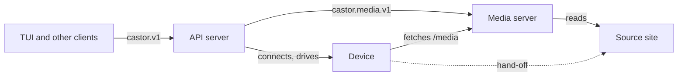
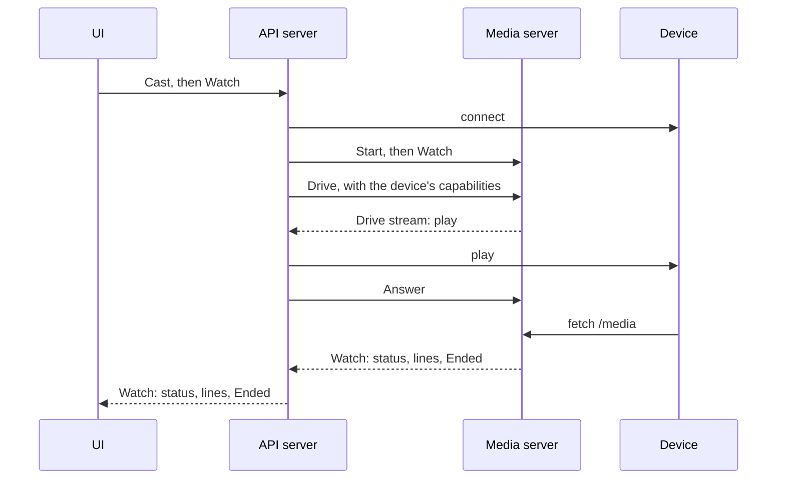
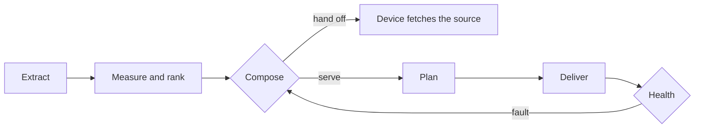

# Architecture

Castor puts web video on a device: a smart TV, a Chromecast or a Roku, called a device throughout the code and the contracts. It is three tiers that speak two protobuf contracts, shipped as three binaries.

## Three tiers

Each tier knows one thing, and runs where that thing is.

- **The UIs know content.** The TUI holds the TMDB catalog, the operator's sources and the screens; another client brings its own. They speak only the public contract, from anywhere.
- **The API server knows devices.** Discovery is multicast and the control protocols (UPnP, Cast, ECP) answer only locally, so it runs on the devices' network. It owns each cast from start to end: the device it connects and drives, the media server's side of the cast, and how it ended.
- **The media server knows streams.** It opens pages in its own browser, measures and ranks what they play, transcodes, burns in subtitles and serves the result under `/media`. It never discovers or controls a device, so it can sit on a NAS or outside the home, with `server.advertise` naming where devices reach it. Pages are opened where their streams are read, so everything the browser learned (headers, cookies, a rendition ladder) reaches ranking whole.

## Topologies

| Setup | What runs where |
| --- | --- |
| On one computer | `castor cast` or `castor scan` runs the TUI, an API server on loopback and a media server in one process. |
| Shared media server | `castor server` (or `castor-media`) on a machine that stays on; each computer runs `castor` with `server.url`, so its API server casts through it. |
| Shared API server | `castor api` (or `castor-api`) on the devices' network; clients set `api.url`. It runs its own media server unless `server.url` names one. |

`castor` links all three tiers and, when a command names no server, runs them in its own process. `castor-media` is the media server alone. `castor-api` is the API server alone: it links no cgo, so it cross-compiles to whatever small machine sits on the devices' network, and it always needs `server.url`.

## Boundaries

- **Tiers share only the generated contracts.** No tier imports another, tests included; a test fakes a neighbour at its contract.
- **Each tier is sealed.** Everything but its entry point (its configuration sections, defaults, commands and adapter wiring) sits behind Go's internal rule, so the compiler refuses any reach into it and one module is enough. Only a binary's main imports an entry point.
- **Consumers declare ports, entry points fill them.** The media server's entry point binds its engine and the cgo whisper transcriber; the API server's lists the device families. What crosses tiers inside one process (an API server for the TUI, a media server for the API server) is a port its consumer declares and `castor` fills.
- **Decisions read capabilities as data.** Device families and source formats are named only at an entry point; nothing else branches on a family or names a site.
- **Plumbing holds no castor concept.** Reading the configuration, serving HTTP behind a token, and the process every binary runs are shared by every tier and know none of them.
- **cgo stays in the media server.** Whisper is its only native dependency, which is what keeps `castor-api` portable.

## The contracts

Both are protobuf, generated with buf for Connect. Each server alone holds its contract's rules: protovalidate checks every request it receives and every message it sends, with CEL where a rule spans fields. Clients check nothing; a refusal names the field and the rule it broke. The media contract imports the public one, so a source, preferences and a watch are the same messages on both.

A device's capabilities (containers, codecs, profiles) are media contract enums. The media server maps them to its own vocabulary at its edge and skips a value it does not know, so a newer API server still drives an older media server.

The API server holds the `cast` defaults (delivery, picture ceiling, subtitles), fills every preference a request leaves unset from them, and checks them against the contract at startup. A client of an API server elsewhere never reads them.

**`castor.v1`**, the public contract, holds only what an integrator cannot do alone. Integrators generate a client in their own language from the protos with buf.

| RPC | What it does |
| --- | --- |
| `DeviceService.ListDevices` | Discovers the devices, each under an id that stays the same across discoveries. |
| `CastService.Cast` | Plays a source on a device, listed or pinned at its address, and returns at once. A source is a stream played as is, or pages whose streams are found and ranked. |
| `CastService.Watch` | Streams the cast's status, its log lines at the level asked, and `Ended` last. |
| `CastService.Stop` | Ends a cast. |
| `CastService.ListCasts` | The casts playing now. |
| `CastService.Resolve` | What `Cast` would play from a source, best first, without casting. |

**`castor.media.v1`** is spoken between the API server and the media server.

| RPC | What it does |
| --- | --- |
| `CastService.Start` | Begins a cast from a source and complete preferences; it waits for a device. |
| `CastService.Stop` | Ends a cast. |
| `CastService.Watch` | Follows a cast, in the public watch's messages. |
| `DeviceService.Drive` | Lends a cast its device, with the device's capabilities, and streams the commands the cast makes of it: play, await end, cancel. |
| `DeviceService.Answer` | Returns each command's result. |
| `StreamService.Rank` | Ranks a source's streams as a cast would, without casting. |

## A cast, start to end

**The media server decides, the API server executes.** Only the media server knows what to play and when to try again, and only the API server can reach the device. So the API server opens `Drive`, a server stream, and the media server sends its commands down it. Every connection still points one way, from UI to API server to media server, and the media server never needs a route into the devices' network.

- **Device first.** The API server connects the device before it starts the media cast (phase `CONNECTING`), so an unreachable device costs no media cast. The media server then reports `EXTRACTING` for pages, `MEASURING` and `CASTING`. A media cast takes one device, and is abandoned if none is lent within a minute.
- **Stopping.** A stop is sent again until the media server takes it, and the device is released once the media cast has ended, or after a few seconds whatever it says. A server shutting down takes no new cast, fails those running, and waits, within its grace, for them to release their devices.
- **Who outlives whom.** A cast belongs to the API server, not to the UI that started it; the CLI stops its cast on Ctrl+C by choice. A media cast plays on if its lender leaves, until it needs the device again.
- **Logs.** A cast's log lines reach its watchers live, at the level each asked, and are never stored.

## Inside the media engine

- **Extraction** opens the pages in headless Chrome and captures the streams they play.
- **Ranking** measures the streams and orders them, best first, preferring the tallest that fits `cast.max_height`; unmeasured ones stay as a last resort.
- **Composition** reads the lent device's capabilities, known before the cast starts. A device that fetches for itself and accepts the source as is gets it handed over, unless `cast.delivery` is `serve`. Otherwise the media server serves it: remuxed on the fly for a device that fetches for itself, read once and encoded for one that never does, such as DLNA. Each composition is logged with its reason under `--debug`.
- **Planning** decides, track by track, what is copied and what is encoded, scaling anything taller than the ceiling. Whisper subtitles are burnt into the picture, so they appear only on read-once casts. Encoding uses the first GPU encoder ffmpeg proves working (VideoToolbox, NVENC, QSV, VA-API, AMF), software otherwise.
- **Delivery** listens on loopback; devices reach it only through the media server's `/media` route.
- **Health** watches for stalls, reads that cannot keep up, and a device that stopped fetching, and answers a fault with a revised attempt, cheapest first, or the next ranked stream.

## Trust boundary

Each server checks its own bearer token (`api.token`, `server.token`) on every API request but health checks, while `/media` stays open because devices cannot authenticate. A media server refusing the API server reaches the API's callers as the API server's own misconfiguration: an internal error naming `server.token`. See [SECURITY.md](SECURITY.md).
