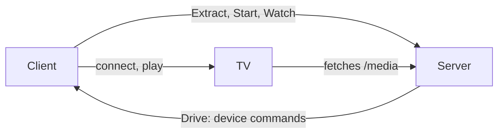
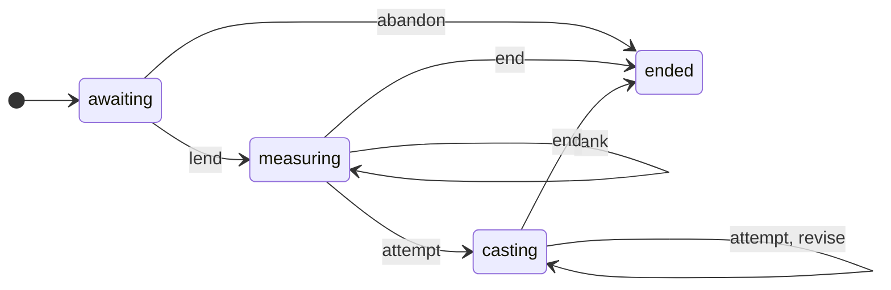
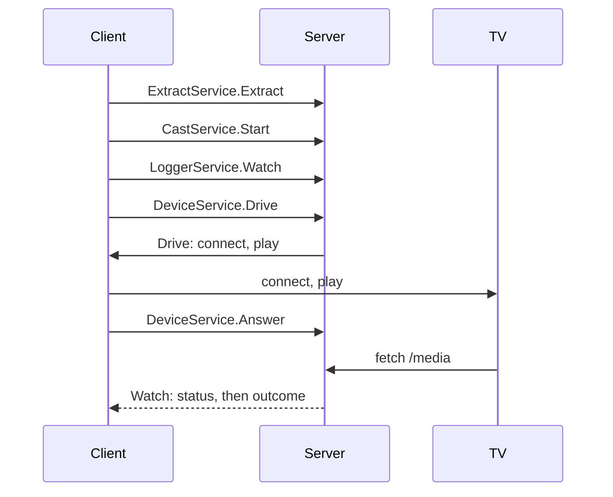
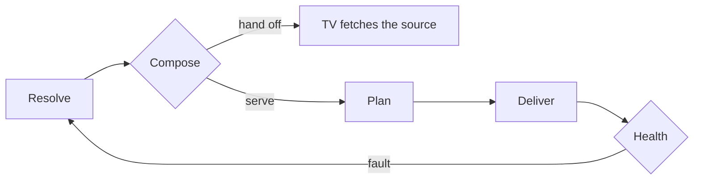

# Architecture

Castor is a client and a server that speak one contract. By default both run in one `castor` process; `castor server` runs the server alone, and clients reach it at `remote.url`.

## Client and server

The client starts the cast and drives the TV for the server; the TV fetches the video from the server.

The split follows what each side can reach.

- **Only the client reaches the TV's network.** Discovery is multicast and the TV's control protocols (UPnP, Cast, ECP) answer only locally.
- **Nothing dials into that network.** The server serves at its own address or at `server.advertise`, so it can sit on a NAS or outside the home.
- **A cast outlives its client.** The client is needed to start playback. Once the TV plays, the client may leave: calls on the device then fail, and the cast plays on until what it serves stops being fetched. A cast that needs its device again after that ends at once.
- **The server knows streams, not catalogs.** TMDB, the operator's sites and the screens stay on the client.

In process, the server keeps its API on loopback and opens only the media route on the network.

## The contract

The contract is protobuf, generated with buf for Connect, one service per file:

| Service | What it does |
| --- | --- |
| `CastService` | `Start` begins a cast from found streams or one named stream, with its preferences; `Stop` ends it. |
| `DeviceService` | `Drive` lends a device to a cast: a server stream of commands (connect, play, stream headers, await end, close, cancel). `Answer` returns each command's result. |
| `LoggerService` | `Watch` streams a cast's status (streams, castable, attempt, latest revision) and, if asked, its live log lines. The stream's own status is the cast's outcome: OK ended, canceled stopped, aborted failed. |
| `StreamService` | `Rank` orders streams as a cast would, without casting; `castor cast --dry-run` uses it. |
| `ExtractService` | `Extract` opens pages in the server's browser and returns the streams they played. |

The server alone holds the contract's rules: protovalidate checks every request it receives and every message it sends, with CEL where a rule spans fields. The client checks nothing itself; a refusal reaches it as `client.ErrRefused`, naming the field and the rule it broke.

A cast has one device, starts once it is lent, and is abandoned if none is lent within a minute; the client watches before it drives, so it misses nothing.

## A cast's lifecycle

A looplab/fsm machine holds it. Every event it takes publishes the status watchers read without a lock, and an event its state does not allow is refused: a cast takes one device, a grace that runs out once a device is lent changes nothing, and nothing changes after the end, which releases the device.

## A cast, start to end

## Inside the engine

Compose either hands the TV the source, or serves it, remuxed on the fly or read once and encoded. Health turns a fault into a revised attempt, or the next ranked stream.

- **Ranking** orders the measured streams, best first; unmeasured ones stay as a last resort.
- **Planning** decides, track by track, what is copied and what is encoded; subtitles from whisper.cpp are burnt into the picture.
- **Delivery** serves on a listener reached only through the media route.
- **Health** watches for stalls, reads that cannot keep up, and a TV that stopped asking; revisions run cheapest first.

## Choices the operator sees

- **Delivery.** `cast.delivery: serve` refuses the hand-off; `castor --debug` logs each composition and why.
- **Picture ceiling.** `resolver.max_height` caps what ranking prefers and what the server produces; a taller source is served scaled down, so the whole title is re-encoded.
- **Encoding.** On the GPU where ffmpeg has one: VA-API on Intel under Linux (`--device /dev/dri` in Docker), VideoToolbox on macOS, software otherwise.
- **Discovery.** SSDP (DLNA, Roku) and mDNS (Chromecast) stop at VLAN and subnet borders and are denied on Android/Termux; a pinned `device.host` is reached by unicast.
- **The tools.** Chrome, ffprobe and ffmpeg are the server's; a client that casts through a remote server needs none.

## Logs

The server's lines for a cast go live to the watchers that asked for them, at the level they asked, and are never stored. The CLI asks for warnings by default and for everything under `--debug`; an in-process server writes its own lines to the terminal only under `--debug`.
