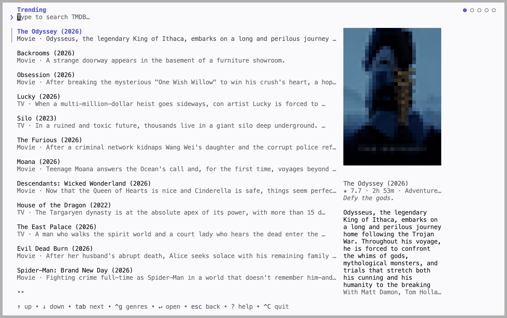

<p align="center">
  
</p>

<p align="center">
  <a href="https://trendshift.io/repositories/86848?utm_source=trendshift-badge&amp;utm_medium=badge&amp;utm_campaign=badge-trendshift-86848" target="_blank" rel="noopener noreferrer"></a>
</p>

<p align="center">
  <a href="https://github.com/stupside/castor/releases/latest">
    
  </a>
  <a href="https://pkg.go.dev/github.com/stupside/castor">
    
  </a>
  <a href="https://github.com/stupside/homebrew-tap/blob/main/Casks/castor.rb">
    
  </a>
  <a href="https://github.com/stupside/castor/blob/main/LICENSE">
    
  </a>
  <a href="https://github.com/stupside/castor/actions">
    
  </a>
</p>

# Castor

Smart TVs won't cast arbitrary web video, and screen mirroring is laggy. Castor puts the video from a web page or a link on your TV, even when the TV can't play it as it is, with generated subtitles if you want them.

Use it on your computer alone, or run a castor server on a machine that stays on, such as a NAS, and cast through it from every computer at home.

*A general-purpose casting tool: it casts only what you point it at. See [Purpose and disclaimer](#purpose-and-disclaimer).*

<p align="center">
  
  <br/>
  <sub><em>Run <code>castor cast</code> to browse titles and cast, without leaving the terminal.</em></sub>
</p>

## Quick start

**1. Install** (macOS. [Other options](#installation))

```sh
brew install --cask stupside/tap/castor
```

**2. Find your TV**

```sh
castor scan
```

**3. Save it to `config.yaml`**, in the directory you run castor from

```yaml
device:
  name: "Living Room TV"   # exact name from `castor scan`
  type: dlna               # or: chromecast, roku
```

**4. Cast**

```sh
castor cast player https://example.com/watch/some-video
```

> `castor scan` found nothing? See [Troubleshooting](#troubleshooting).

## Commands

| Command | What it does |
| --- | --- |
| `castor scan` | List the devices on your network |
| `castor cast player <url>` | Cast a web page with an embedded video player |
| `castor cast url <url>` | Cast a direct stream or video URL |
| `castor cast` | Browse titles and cast, interactively (needs a [TMDB key](#tmdb-key)) |
| `castor cast movie <id>` | Resolve a movie id against your [sources](#sources) and cast |
| `castor cast episode <id> --season N --episode N` | Same, for a TV episode |
| `castor server` | Run the media server other computers cast through ([another machine](#run-castor-on-another-machine)) |
| `castor api` | Serve castor's API, for apps and integrations ([another machine](#run-castor-on-another-machine)) |

`castor cast --dry-run ...` prints the streams it found instead of casting. Run `castor --help` for all flags.

## Installation

Castor runs best as a native binary on the same network as your TV. It needs three tools on your `PATH`:

| Tool | Version | Used for |
| --- | --- | --- |
| **Chrome / Chromium** | Any recent | Finding the video on a page |
| **ffmpeg** | 7.1+ (older builds reject flags castor uses) | Converting the video for your TV |
| **ffprobe** | 7.1+ | Reading the video's format |

Castor converts video on the GPU when ffmpeg can (VideoToolbox, NVENC, Quick Sync, VA-API or AMF, whichever works first), and in software otherwise.

- **macOS:** `brew install --cask stupside/tap/castor`.
- **Linux:** download `castor_<version>_linux_amd64.tar.gz` (or `_arm64`) from the [latest release](https://github.com/stupside/castor/releases/latest) and put `castor` on your `PATH`.
- **Windows:** download `castor_<version>_windows_amd64.zip` (or `_arm64`), extract `castor.exe` into a folder on your `PATH`, and install the tools with `winget install Gyan.FFmpeg` and `winget install Google.Chrome`. On first run, SmartScreen may block the unsigned binary (choose *More info*, then *Run anyway*), and the firewall asks about network access: allow it on **private** networks, or Castor finds no devices.
- **From source:** see [CONTRIBUTING.md](CONTRIBUTING.md).

## Configuration

Castor reads `config.yaml` from the working directory (or `--config <path>`). Casting from the command line needs `device`; every other key has a default. Any key can also be set as a `CASTOR_SECTION__FIELD` environment variable, e.g. `CASTOR_CAST__MAX_HEIGHT=720`.

> [!TIP]
> Keep secrets (keys, tokens, passwords) in a git-ignored `config.local.yaml`, which overlays `config.yaml`, or in environment variables. See [SECURITY.md](SECURITY.md).

### Subtitles

Generated subtitles, burned into the video. The model downloads once to your user cache.

```yaml
cast:
  subtitles: en            # a language code, or auto to detect it; unset for none
whisper:
  # model_path: ""         # default: ggml-tiny.en (~75 MB, English only)
```

For another language or `auto`, point `whisper.model_path` at a multilingual whisper.cpp model (e.g. `ggml-base.bin`).

> [!NOTE]
> Burn-in applies only to devices castor always streams to, such as DLNA. A device that fetches the video itself (Chromecast, Roku) gets none, even when castor relays it.

### Video quality

Set `max_height` to your TV's vertical resolution: castor picks the tallest stream that fits and scales down anything taller it knows about. Raise it if you'd rather the TV play a taller video as it is.

```yaml
cast:
  max_height: 2160         # default: 1080
```

### Sources

`cast movie`, `cast episode`, and the interactive browser turn a title id into a page URL. Castor bundles no sources: you add your own, for sites you are authorized to use. The id is substituted into your `templates` under each of your `proxies`, and the page is cast like `cast player`.

```yaml
sources:
  - proxies: ["https://your-source.example"]   # base URLs, tried in order
    templates:
      movie: "/embed/movie/{itemID}"
      episode: "/embed/tv/{itemID}/{season}-{episode}"
```

So `castor cast movie tt12300742` opens `https://your-source.example/embed/movie/tt12300742`.

### TMDB key

Only the interactive browser (`castor cast`) needs one. Get a free key from [themoviedb.org](https://www.themoviedb.org/settings/api):

```yaml
tmdb:
  api_key: "<KEY>"
```

## Run castor on another machine

### A shared media server

A machine that stays on, such as a NAS, does the heavy work; your computer finds the TV and drives it. On the server, with a token in its config:

```sh
castor server   # listens on :8410 (server.listen)
```

On your computer:

```yaml
server:
  url: http://my-nas:8410
  token: "<a long random string, the same on both>"
```

Once the TV plays, closing the terminal leaves the cast playing; Ctrl+C stops it. Subtitles, quality and delivery come from your computer's config; the whisper model is the server's. For a server outside your home network, set where the TV reaches it with `server.advertise` (e.g. `http://castor.example.com:8410`) and put it behind HTTPS.

### The API, for apps and integrations

Everything castor does to your TVs is an API: list them, cast a link or a page on one, follow the cast, stop it. Run it on a machine on your TV's network:

```sh
castor api   # listens on :8411 (api.listen)
```

```sh
curl -X POST http://localhost:8411/castor.v1.DeviceService/ListDevices \
  -H "Authorization: Bearer $TOKEN" \
  -H 'Content-Type: application/json' -d '{}'

curl -X POST http://localhost:8411/castor.v1.CastService/Cast \
  -H "Authorization: Bearer $TOKEN" \
  -H 'Content-Type: application/json' \
  -d '{"target": {"deviceId": "<id from ListDevices>"}, "source": {"stream": {"url": "https://example.com/video.m3u8"}}}'
```

Set `api.token` once the API leaves your machine; the header is needed only then. A page instead of a link is `"source": {"pages": {"urls": ["https://example.com/watch"]}}`. End a cast with `Stop`. `Watch` follows a cast to its end; it is a server stream, so use [`buf curl`](https://buf.build/docs/reference/cli/buf/curl), `grpcurl`, or a client generated from the [contract](proto/castor/v1) with [buf](https://buf.build). Point other castor commands at it with `api.url` and `api.token`.

## Supported devices

| Protocol | Works with | Status |
| --- | --- | --- |
| **DLNA / UPnP** (`MediaRenderer:1`) | Most smart TVs, and players like Kodi, VLC, and Plex | Tested on Samsung |
| **Chromecast** | Google Cast devices | Experimental, not yet tried on real hardware |
| **Roku** | Roku TVs and players, through a sideloaded channel | Experimental, not yet tried on real hardware |

### Roku setup

Roku can't play an arbitrary URL from a preinstalled app, so Castor installs a small channel of its own:

1. **Turn on Developer Mode** (once, by hand): on the remote press **Home x3, Up x2, Right, Left, Right, Left, Right**, enable developer mode, and set a **web-server password**. The device reboots.
2. **Put the password in your config** (out of git, see [Configuration](#configuration)):
   ```yaml
   devices:
     roku:
       password: "<dev-web-server-password>"   # first cast only
   ```
3. **Cast.** Castor sideloads its channel automatically; later casts reuse it.

Already published the channel to your account? Set `devices.roku.app_id` to its numeric id instead: no dev mode, no password. When castor relays the video, a Roku plays about 30 s behind.

## Troubleshooting

### `castor scan` finds nothing: pin the device by IP

Discovery doesn't cross VLANs or subnets, and is blocked on Android/Termux (`netlinkrib: permission denied`). Pinning a `host` reaches the device directly, and skips the discovery wait.

```yaml
device:
  name: "Living Room TV"   # now just a label
  type: dlna
  host: 192.168.0.3        # the device's LAN IP
```

If a DLNA TV doesn't answer at its IP, use its full description URL instead (e.g. `http://192.168.0.3:9197/dmr`). On Android/Termux, also leave `network.interface` empty (the default): pinning one needs the same blocked interface lookup.

### The page won't play

Castor plays the page to find its video, so it only works on pages whose video starts without a click. DRM-protected streams are refused.

### The device loads the stream but plays nothing

Have castor always send the video itself, rather than handing the TV the link:

```yaml
cast:
  delivery: serve   # "auto" (the default) decides per source
```

Relaying costs bandwidth and CPU, so try it once first with `CASTOR_CAST__DELIVERY=serve`. `castor --debug` logs which way each cast went and why.

## Docker

The `ghcr.io/stupside/castor` image is the full `castor` with Chrome, ffmpeg, and ffprobe. It converts video on an Intel GPU through VA-API when you pass `--device /dev/dri`, and in software otherwise.

> [!WARNING]
> Discovery and the API server need `--network host`, which Docker Desktop (macOS/Windows) ignores, so `scan` finds nothing there. Use the native binary instead.

```sh
docker run --rm --network host ghcr.io/stupside/castor:latest scan

docker run --rm --network host --device /dev/dri \
  -v "$PWD/config.yaml:/config.yaml" \
  -v castor-cache:/root/.cache \
  ghcr.io/stupside/castor:latest \
  cast player https://example.com/watch/some-video
```

The `castor-cache` volume keeps downloaded whisper models. To keep a server running, pass `-d` with `server` (and `-e CASTOR_SERVER__TOKEN=<token>`) or `api` (and `-e CASTOR_API__TOKEN=<token>`). A lone `server` can also run without host networking: publish `-p 8410:8410` and set `server.advertise`. Health checks (`grpc.health.v1.Health`) need no token, so an orchestrator can probe either server.

Tags: `:latest` (stable), `:canary` (preview), or a pinned `:vX.Y.Z`.

## Purpose and disclaimer

- **It hosts nothing.** No bundled video, catalog, or sources. Castor casts only what you supply and are authorized to use.
- **It does not touch DRM.** It never decrypts or circumvents DRM, and refuses protected streams.
- **Lawful use is your responsibility.** Check a site's terms and your local law. Provided as-is for lawful, personal, and educational use.

## Contributing

See [CONTRIBUTING.md](CONTRIBUTING.md), and [ARCHITECTURE.md](ARCHITECTURE.md) for how castor works inside.
