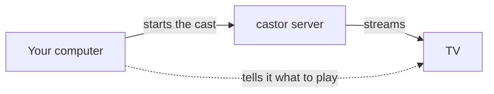

<p align="center">
  
</p>

<p align="center">
  <a href="https://trendshift.io/repositories/86848?utm_source=trendshift-badge&amp;utm_medium=badge&amp;utm_campaign=badge-trendshift-86848" target="_blank" rel="noopener noreferrer"></a>
</p>

<p align="center">
  <a href="https://github.com/stupside/castor/releases/latest">
    
  </a>
  <a href="https://pkg.go.dev/github.com/stupside/castor">
    
  </a>
  <a href="https://github.com/stupside/homebrew-tap/blob/main/Casks/castor.rb">
    
  </a>
  <a href="https://github.com/stupside/castor/blob/main/LICENSE">
    
  </a>
  <a href="https://github.com/stupside/castor/actions">
    
  </a>
</p>

# Castor

Smart TVs won't cast arbitrary web video, and screen mirroring is laggy. Castor puts the video from a web page or a link on your TV, even when the TV can't play it as it is, with generated subtitles if you want them.

Use it on your computer alone, or run a castor server on a machine that stays on, such as a NAS, and cast through it from every computer at home.

*A general-purpose casting tool: it casts only what you point it at. See [Purpose and disclaimer](#purpose-and-disclaimer).*

<p align="center">
  
  <br/>
  <sub><em>Run <code>castor cast</code> to browse titles and cast, without leaving the terminal.</em></sub>
</p>


## Quick start

**1. Install** (macOS. [Other options](#installation))

```sh
brew install --cask stupside/tap/castor
```

**2. Find your TV**

```sh
castor scan
```

**3. Save it to `config.yaml`**

```yaml
device:
  name: "Living Room TV"   # exact name from `castor scan`
  type: dlna               # or: chromecast, roku
```

**4. Cast**

```sh
castor cast player https://example.com/watch/some-video
```

See [Configuration](#configuration) for subtitles, quality, and title search.

> `castor scan` found nothing? See [Troubleshooting](#troubleshooting).


## Commands

| Command | What it does |
| --- | --- |
| `castor scan` | List cast targets on your network |
| `castor cast player <url>` | Cast a web page with an embedded video player |
| `castor cast url <url>` | Cast a direct stream or video URL |
| `castor cast` | Browse titles and cast, interactively (needs a [TMDB key](#tmdb-key)) |
| `castor cast movie <id>` | Resolve a movie id against your [sources](#sources) and cast |
| `castor cast episode <id> --season N --episode N` | Same, for a TV episode |
| `castor server` | Run castor as the media server other machines cast through ([media server](#media-server)) |

Run `castor --help` for all flags.


## Media server



Your computer starts the cast and tells the TV what to play; the TV then streams from the server.

On the server:

```sh
castor server   # listens on :8410 (server.listen)
```

On your computer:

```yaml
remote:
  url: http://my-nas:8410
```

Once the TV plays, you can close castor on your computer; Ctrl+C stops the cast instead. Subtitles, quality and delivery still come from your computer's config.

For a server outside your home network, set where the TV reaches it with `server.advertise` (e.g. `http://castor.example.com:8410`). The server has no password: only run it on a network you trust.


## Installation

Castor runs best as a native binary on the same network as your TV. It needs three tools on your `PATH`.

| Tool | Version | Used for |
| --- | --- | --- |
| **Chrome / Chromium** | Any recent | Finding the video on a page |
| **ffmpeg** | 7.1+ | Converting the video for your TV |
| **ffprobe** | 7.1+ | Reading the video's format |

> [!IMPORTANT]
> ffmpeg and ffprobe must be **7.1 or newer**: older builds reject flags Castor uses.

### Windows

Download `castor_<version>_windows_amd64.zip` (or `_arm64.zip` for Windows on ARM) from the [latest release](https://github.com/stupside/castor/releases/latest), extract `castor.exe` into a folder on your `PATH`, and install the tools:

```powershell
winget install Gyan.FFmpeg     # ffmpeg + ffprobe
winget install Google.Chrome   # skip if Chrome is already installed
```

On first run:

- **SmartScreen** may block the unsigned binary: choose *More info*, then *Run anyway*.
- **Windows Defender Firewall** asks about network access: allow it on **private** networks, or Castor finds no devices.

### Build from source

On macOS or Linux, with **Go 1.27+** and **cmake**. Clone with submodules, then `make`:

```sh
git clone --recurse-submodules https://github.com/stupside/castor.git
cd castor
make          # builds libwhisper.a, then the castor binary
```

`go install` won't work: the whisper.cpp bindings need that locally built library.


## Configuration

Castor reads `config.yaml` from the working directory (or `--config <path>`). Only `device` is required; every key can also be set as a `CASTOR_SECTION__FIELD` environment variable, e.g. `CASTOR_RESOLVER__MAX_HEIGHT=720`.

> [!TIP]
> Keep secrets in a git-ignored `config.local.yaml`, which overlays `config.yaml`, or in environment variables. See [SECURITY.md](SECURITY.md).

### Subtitles

Generated subtitles, burned into the video. The model downloads once to your user cache.

```yaml
whisper:
  enable: true             # off by default
  # language: "fr"         # default: English
  # model_path: ""         # default: ggml-tiny.en (~75 MB, auto-downloaded)
```

> [!NOTE]
> DLNA only: Chromecast and Roku don't get burned-in subtitles.

### Video quality

Set `max_height` to your TV's vertical resolution; nothing taller reaches it. Raise it if you'd rather the TV play a taller video as it is.

```yaml
resolver:
  max_height: 2160         # default: 1080
```

### Sources

`cast movie`, `cast episode`, and the interactive browser turn a title id into a page URL. Castor bundles no sources: you add your own, for sites you are authorized to use. The id is substituted into your `templates` under each of your `proxies`, and the page is extracted like `cast player`.

```yaml
sources:
  - proxies: ["https://your-source.example"]   # base URLs, tried in order
    templates:
      movie: "/embed/movie/{itemID}"
      episode: "/embed/tv/{itemID}/{season}-{episode}"
```

So `castor cast movie tt12300742` opens `https://your-source.example/embed/movie/tt12300742`.

### TMDB key

Only the interactive browser (`castor cast`) needs one. Get a free key from [themoviedb.org](https://www.themoviedb.org/settings/api):

```yaml
tmdb:
  api_key: "<KEY>"
```

### Forcing a relay

When a TV refuses a video for no visible reason, have castor always send it the video itself:

```yaml
cast:
  delivery: serve   # "auto" (the default) decides per source
```

Relaying costs bandwidth and CPU, so try it once first with `CASTOR_CAST__DELIVERY=serve`.


## Supported devices

Run `castor scan` to list what is on your network.

| Protocol | Works with | Status |
| --- | --- | --- |
| **DLNA / UPnP** (`MediaRenderer:1`) | Most smart TVs, and players like Kodi, VLC, and Plex | Tested on Samsung |
| **Chromecast** | Google Cast devices | Experimental, not yet tried on real hardware |
| **Roku** | Roku TVs and players, through a sideloaded channel | Experimental, not yet tried on real hardware |

### Roku setup

Roku can't play an arbitrary URL from a preinstalled app, so Castor installs a small channel of its own. That needs one extra step.

**1. Turn on Developer Mode** (once, by hand: there's no remote API for it)

On the Roku remote press **Home x3, Up x2, Right, Left, Right, Left, Right**, enable developer mode, and set a **web-server password**. The device reboots.

**2. Put the password in your config**

```yaml
device:
  name: "Living Room"   # from `castor scan`
  type: roku
  roku:
    password: "<dev-web-server-password>"   # first cast only
```

Keep it in a git-ignored `config.local.yaml`, or set `CASTOR_DEVICE__ROKU__PASSWORD`.

**3. Cast.** Castor sideloads its channel automatically; later casts reuse it.

Already published the channel to your account? Set `device.roku.app_id` to its numeric id instead: no dev mode, no password.

> [!NOTE]
> Roku plays about 30 s behind, so it starts slower than DLNA.


## Troubleshooting

### `castor scan` finds nothing: pin the device by IP

Discovery doesn't cross VLANs or subnets, and is blocked on Android/Termux (`netlinkrib: permission denied`). Pinning a `host` reaches the device directly, and skips the discovery wait.

```yaml
device:
  name: "Living Room TV"   # now just a label
  type: dlna
  host: 192.168.0.3        # the device's LAN IP
```

If a DLNA TV doesn't answer at its IP, use its full description URL instead (e.g. `http://192.168.0.3:9197/dmr`).

> On Android/Termux, also leave `network.interface` empty (the default): pinning one needs the same blocked interface lookup.

### The page won't play

Castor plays the page to find its video, so it only works on pages whose video starts without a click. DRM-protected streams are refused.

### The device loads the stream but plays nothing

Try [forcing a relay](#forcing-a-relay).


## Docker (optional)

The `ghcr.io/stupside/castor` image bundles Chrome, ffmpeg, and ffprobe. Run it on a Linux host on your TV's network.

> [!WARNING]
> `--network host` is required, and Docker Desktop (macOS/Windows) ignores it, so `scan` finds nothing there. Use the native binary instead ([macOS](#quick-start), [Windows](#windows)).

```sh
# Discover devices (no config needed)
docker run --rm --network host ghcr.io/stupside/castor:latest scan

# Cast, passing a Linux render device through for hardware transcoding
docker run --rm --network host --device /dev/dri \
  -v "$PWD/config.yaml:/config.yaml" \
  -v castor-cache:/root/.cache \
  ghcr.io/stupside/castor:latest \
  cast player https://example.com/watch/some-video
```

- `--device /dev/dri` lets Castor convert video on an Intel GPU.
- Run from the directory holding your [`config.yaml`](config.yaml).
- The `castor-cache` volume keeps downloaded whisper models.
- `docker run -d --network host ghcr.io/stupside/castor:latest server` runs the image as a [media server](#media-server) for castor on your laptop. Without host networking, set `server.advertise`.

| Tag | Build |
| --- | --- |
| `:latest` | Latest stable release |
| `:canary` | Latest preview build |
| `:v1.7.0` | A specific pinned version |


## Purpose and disclaimer

Castor is a general-purpose caster, not a service tied to any site.

- **It hosts nothing.** No bundled video, catalog, or sources. It casts only what you supply and are authorized to use.
- **It does not touch DRM.** It never decrypts or circumvents DRM, and refuses protected streams.
- **Lawful use is your responsibility.** Check a site's terms and your local law. Do not use it to infringe copyright.

Provided as-is for lawful, personal, and educational use.


## Contributing

See [CONTRIBUTING.md](CONTRIBUTING.md), and [ARCHITECTURE.md](ARCHITECTURE.md) for how castor works inside.
